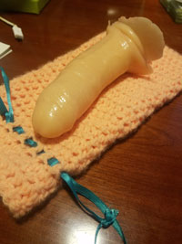
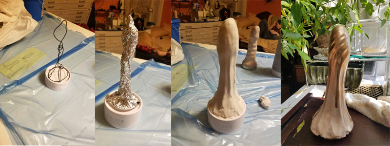

**Sunday, December 9**  
**Noon-5pm**  
**$89 per ticket**

Join us for an arousing day of crafting as we explore the exotic arts of silicone casting. Come to our door with only the dream of a dick you desire and you may go home that day with a piece of art you can enjoy that very night.

In this exclusive five-hour hands-on workshop, locally renowned phallic artist Ms. Polyjuiced will lead you through the complete process of crafting your very own homemade artisanal dildo. You’ll go from sculpting a prototype, to casting a mould, to coloring and mixing the liquid rubber, and finally casting an utterly unique toy that will last for generations to come.

The workshop will be hosted in Ms. Polyjuiced’s personal crafting parlour, and so an absolute limit of 8 tickets will be available for each class. Anyone who cannot maintain a high standard of polite behavior will be asked to leave. Light fare including sandwiches and snacks will be provided, along with a selection of teas, soda, and other beverages.

Prospective pupils are encouraged to come prepared with a design concept for the dick they desire to create. A drawing or photo is advised, although many samples will also be on hand for reference and inspiration. All other necessary materials will be provided, including vibrating motors for those who prefer their dick accompanied by mild buzz.

For those interested in more true-to-life sculpture, we are also planning to have at least one demonstration of a live casting at our class. This is an especially tricky process, as live dicks are notoriously difficult to work with, but the results can be very rewarding. If you are interested in bringing your own live dick model, please contact Ms. Polyjuiced in advance to discuss necessary arrangements.

The art of dicksmithery is a complex and tricky one, but with proper guidance and determination, it should be well within the grasp of anyone willing to put in the effort. Disappointment is always a risk when exploring new things, and we cannot guarantee that every pupil will go home with the finished product they hoped to create. However, everyone will certainly leave us with a solid grounding in the multifaceted art of silicone sculpting, and will have enjoyed a lovely Sunday afternoon making art with other like-minded deviants along the way.

